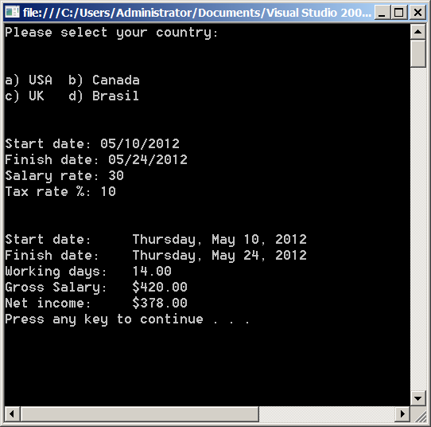
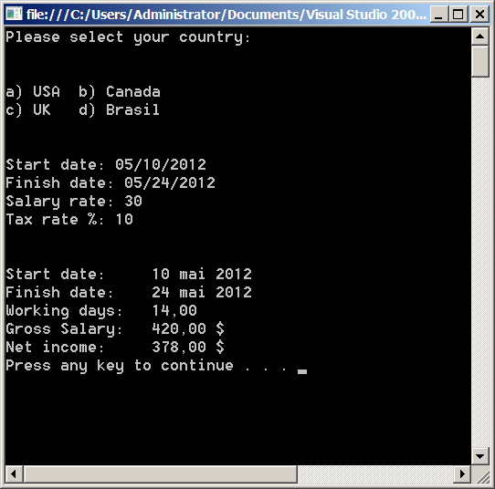
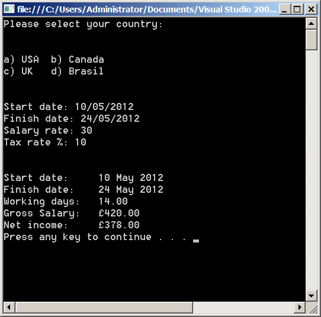
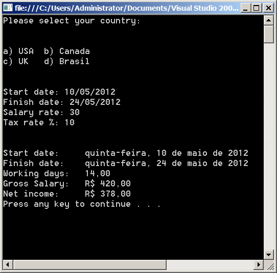

# Utilizando localización y globalización (localization and globalization) en .NET

La globalización y la localización (localization and globalization) son características que permiten que las aplicaciones .NET se adapten a múltiples idiomas y culturas utilizando las diferentes configuraciones regionales de cada uno de los equipos en donde se ejecutan, con el objetivo de que los usuarios visualicen de forma correcta los datos mostrados en la interfaz de usuario de acuerdo con sus preferencias locales.

El mundo se encuentra dividido en múltiples regiones y culturas, una cultura (cultura) en el contexto de .NET se refiere al idioma y al conjunto de preferencias regionales para calendarios, cadenas, números y monedas.

.NET cumple con el estándar RFC 1766 del IETF para la identificación de culturas mediante un identificador que se construye con las siguientes reglas:
a) Existen códigos de idiomas o culturas neutrales que se representan por letras minúsculas como ejemplo la siguiente tabla:

    <table>
        <tr>
            <td><b>Código</b></td>
            <td><b>Idioma</b></td>
        </tr>
        <tr>
            <td>en</td>
            <td>Inglés</td>
        </tr>
        <tr>
            <td>de</td>
            <td>Alemán</td>
        </tr>
        <tr>
        <td>es</td>
        <td>Español</td>
        </tr>
        <tr>
        <td>fr</td>
        <td>Francés</td>
        </tr>
    </table>

b) Además de los códigos de idiomas existen códigos de subculturas específicas que corresponden a una región geográfica, estas subculturas se representan en letras mayúsculas como ejemplo la siguiente tabla:

    <table>
        <tr>
            <td>
                <b>Subcultura</b>
            </td>
            <td>
                <b>Región</b>
            </td>
        </tr>
        <tr>
            <td>
                GB
            </td>
            <td>
                Great Britain
            </td>
        </tr>
        <tr>
            <td>
                CA
            </td>
            <td>
                Canadá
            </td>
        </tr>
        <tr>
            <td>
                MX
            </td>
            <td>
                México
            </td>
        </tr>
        <tr>
            <td>
                BR
            </td>
            <td>
                Brasil
            </td>
        </tr>
    </table>

Los códigos de los idiomas (a) se combinan con los códigos de las regiones (b) asociándolos mediante un (-) entre ellos por lo que un mismo lenguaje puede ser hablado en diferentes regiones así por ejemplo: Español en España (es-ES), Español en México (es-MX), Español en Argentina (es-Ar) o
Inglés en UK (en-UK), Inglés en USA (en-USA), Inglés en Canadá (en-CA) por mencionar algunos casos.
Uno de los primeros pasos para implementar la localización y globalización en las aplicaciones .NET es el uso de la clase <a href="http://msdn.microsoft.com/en-us/library/system.globalization.cultureinfo.aspx">CultureInfo</a> la cual encapsula información referente a una cultura específica, información acerca  de su idioma, el calendario, los formatos de números y monedas, la dirección del texto entre otros valores.
Como ejemplo escribí la rutina de un programa de nómina para una compañía que tiene sucursales en USA, UK, Canadá y Brasil, este programa calcula el salario bruto y el pago neto de un empleado de acuerdo a su tarifa por hora, también calcula el número de horas trabajadas y la retención del impuesto correspondiente.
El código a continuación:

<pre>

</pre>

Este código muestra la utilización de la clase <a href="http://msdn.microsoft.com/en-us/library/system.globalization.cultureinfo.aspx">CultureInfo</a> primero invoca al ensamblado <i>System.Globalization</i>

Segundo solicita al usuario que seleccione un país que está asociado con el código de una cultura soportada por el .NET Framework.

<pre>
Console.WriteLine("a) USA \tb) Canada");
Console.WriteLine("c) UK  \td) Brasil");
Console.WriteLine("\n");
ConsoleKeyInfo option = Console.ReadKey(true);
</pre>

La cultura seleccionada se establece en el hilo principal de ejecución, cuyo valor predeterminado es el de la configuración regional del sistema operativo. Esto lo hace el siguiente bloque de código:

<pre>
switch (option.Key) { 
   case ConsoleKey.A:
        ci = new CultureInfo("en-US");
        break;
   case ConsoleKey.B:
        ci = new CultureInfo("fr-CA");
        break;
   case ConsoleKey.C:
        ci = new CultureInfo("en-GB");
        break;
   case ConsoleKey.D:
        ci = new CultureInfo("pt-BR");
        break;
   default:
        ci = Thread.CurrentThread.CurrentCulture;
        break;
    }
</pre>

Al ejecutar la aplicación como resultado se pueden ver las diferencias entre los formatos de fechas, números y monedas de acuerdo a la cultura seleccionada.

Resultado de la  clase <i>CultureInfo</i> con la opción <i>“en-US”</i>, el formato de fechas es mes, día y año. (mm/dd/yyyy)

        

 

Resultado de la opción <i>"fr-CA"</i>, las fechas de entrada tienen el mismo formato que la cultura “en-US” , pero hay diferencia en el idioma de las fechas y en la moneda.

        

 

Resultado de la opción  <i>“en-GB”</i>, (english-Great Britain) el formato de las fechas de entrada son diferentes al de USA y Canadá ya que utiliza día, mes y año (dd/mm/yyyy), para las cantidades muestra el símbolo de la libra esterlina.

        
    
 

Resultado de la clase <i>CultureInfo</i> con la opción “pt-BR” (portugués Brasil) se ve la diferencia en las fechas y en la moneda ya que antepone una R de Real la moneda de Brasil.

        
    
 

En caso de que el formato de algún dato introducido no coincida con el formato de la cultura establecida, el programa arrojará una exception, en este caso seleccione la opción USA e intenté introducir las fechas con el formato día, mes y año (dd/mm/yyyy) coincidió en la primera fecha (aunque no era la fecha que quería) y arrojo la excepción en la segunda fecha por tener un formato incorrecto.

